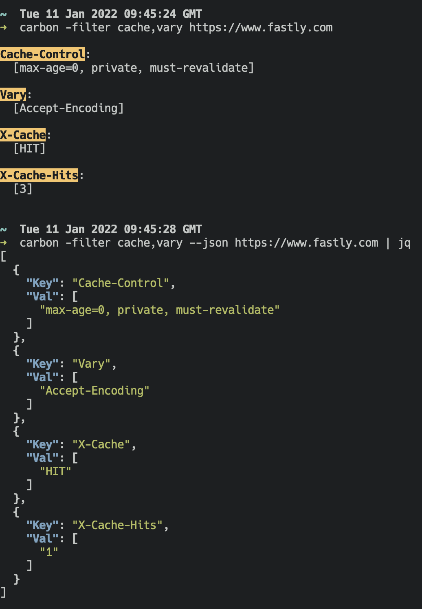

# Carbon

Carbon is a tool that issues HTTP requests, then parses, sorts and displays relevant HTTP response headers. 

> **NOTE**: The name 'carbon' comes from carbon filtering: method of filtering impurities.

By default it will display all response headers with coloured keys, but headers can also be filtered, as well as parsed into JSON for easier piping/analysis...



## Install

```bash
go install github.com/integralist/carbon@latest
```

## Build

To build and install the `carbon` executable locally, then run:

```bash
make install
```

## Usage

```bash
carbon -help

Usage of carbon:
  -filter string
        comma-separated list of headers to be displayed
        e.g. cache,vary
  -help
        show available flags
  -json
        output is formatted into JSON for easy parsing
  -plain
    	  output is formatted without any extraneous spacing or ANSI colour codes
```

No filter...

```bash
carbon https://www.fastly.com/

Accept-Ranges:
  [bytes]

Cache-Control:
  [max-age=0, private, must-revalidate]

Content-Type:
  [text/html]

Date:
  [Tue, 27 Oct 2020 09:55:39 GMT]

Etag:
  ["c248491ee6293167e071523b47b4625e"]

Server:
  [Artisanal bits]

Strict-Transport-Security:
  [max-age=31536000]

Vary:
  [Accept-Encoding]

X-Cache:
  [HIT]

X-Content-Type-Options:
  [nosniff]

X-Frame-Options:
  [DENY]

X-Xss-Protection:
  [1; mode=block]

Status Code: 200 OK
```

With filter...

```bash
carbon -filter cache,vary https://www.fastly.com

Cache-Control:
  [max-age=0, private, must-revalidate]

Vary:
  [Accept-Encoding]

X-Cache:
  [HIT]

Status Code: 200 OK
```

With filter AND json...

```bash
carbon -filter cache,vary --json https://www.fastly.com

[{"Key":"Cache-Control","Val":["max-age=0, private, must-revalidate"]},{"Key":"Vary","Val":["Accept-Encoding"]},{"Key":"X-Cache","Val":["HIT"]},{"Key":"X-Cache-Hits","Val":["2"]}]
```

Plain...

```bash
carbon -filter cache,vary -plain https://www.fastly.com

Cache-Control: max-age=0, private, must-revalidate
Vary: Accept-Encoding
X-Cache: HIT
Status Code: 200 OK
```

## Tests?

Nope. This was just a quick hack

## Bash Alternative?

Here's an official repo for the [Bash version](https://github.com/Integralist/Bash-Headers) (if you're interested, although it's a lot more basic but was the starting point that motivated me to do this go version).
